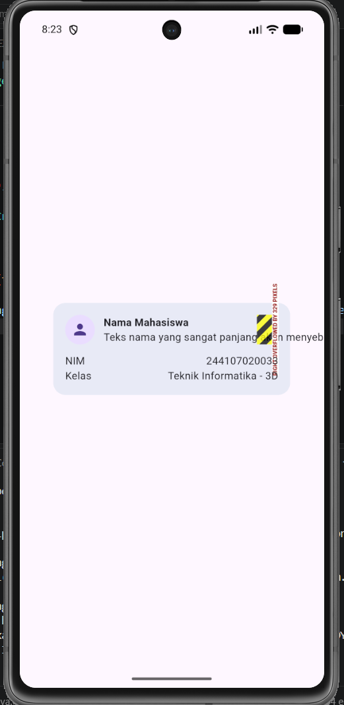

# WEEK_2

## Tujuan

- Menjelaskan prinsip declarative UI dan hubungan antara widget, konfigurasi, serta state.
- Menggunakan StatelessWidget, StatefulWidget, Container, Row, Column, dan Expanded.
- Membedakan komponen Material 3 dan Cupertino untuk kebutuhan platform yang berbeda.
- Membangun layout responsif untuk ukuran layar mobile dan tablet.
- Menerapkan theme, dark mode, styling, dan aksesibilitas dasar.

# 1. Eksperimen Warm-Up
Pada tahap awal, dilakukan pengenalan tata letak dasar Flutter melalui beberapa eksperimen modifikasi parameter:

1. Menghapus Expanded pada Row: Menghapus Expanded pada kolom nama menyebabkan teks berisiko mengalami overflow (menembus batas layar) jika karakternya terlalu panjang karena Row tidak memberikan batasan ruang maksimal secara default.

2. Mengubah mainAxisSize: Mengubah MainAxisSize.min ke nilai bawaan (MainAxisSize.max) pada Column menyebabkan kartu profil memanjang secara vertikal hingga memenuhi seluruh tinggi layar, karena Column mencoba mengambil seluruh ruang yang tersedia.

3. Menambah Baris Baru: Mengimplementasikan pola Row + Expanded untuk menambahkan baris informasi Email dengan tata letak yang konsisten.

# 2. Eksperimen Layout & Aksesibilitas
Mengembangkan rancangan dashboard dinamis dengan pengujian berikut:

Perubahan Breakpoint: Memodifikasi constraints.maxWidth dari 700 ke 500 membuat aplikasi beralih ke tata letak dua kolom lebih cepat, bahkan pada layar ponsel dengan orientasi lanskap.

Eksperimen Tema: Menguji pengubahan mode tema secara dinamis menggunakan themeMode: ThemeMode.system dan peralihan hardcode ke mode gelap.

Penerapan Semantics: Mengimplementasikan screen reader accessibility menggunakan widget Semantics pada CupertinoSwitch dan membungkus kartu informasi untuk menggabungkan pembacaan judul dan nilai agar logis bagi penyandang tunanetra.

# 3. Tugas Utama & Refactoring Challenge (Academic Overview)
Mengembangkan halaman Academic Overview responsif dengan struktur header profil dan empat kartu indikator utama.

Implementasi Refactoring:
1. Ekstraksi Widget: Memisahkan struktur kartu menjadi reusable widget bernama InfoCard yang menerima parameter title dan value agar mematuhi prinsip DRY (Don't Repeat Yourself).

2. Tema Dinamis: Mengganti warna dan ukuran yang di-hardcode dengan Theme.of(context) (seperti theme.colorScheme.surfaceContainerHighest) agar antarmuka beradaptasi secara otomatis saat tema beralih.

3. Konstanta Breakpoint: Memindahkan batas ukuran responsif ke dalam satu konstanta global const double kWideBreakpoint = 700.0;.

4. Code Analysis: Menyelesaikan masalah linter dengan mengganti metode .withOpacity() yang deprecated menjadi .withValues(alpha: ...) sehingga evaluasi flutter analyze mencetak status No issues found!.

# 4. Testing Dasar
Memverifikasi responsivitas menggunakan flutter test dengan menyesuaikan konfigurasi pada berkas uji. Pengukuran dimensi kartu dieksekusi dengan metode .first (tester.getSize(find.byType(Card).first).width) untuk mengatasi limitasi pencarian pada antarmuka yang memiliki multiple widget berjenis sama. Seluruh tes uji untuk layar sempit (1 kolom) dan layar lebar (2 kolom) berhasil lulus (passed).

# 5. AI Design Exploration & Audit
Eksplorasi tata letak memanfaatkan pendekatan LayoutBuilder + SingleChildScrollView + Column/Row alih-alih GridView.

Trade-off Responsivitas: GridView memaksa elemen menyesuaikan aspect ratio, sehingga menyebabkan teks overflow atau terpotong (clipping) saat layar ekstrem. Pendekatan LayoutBuilder + Column memungkinkan teks membungkus (wrap) ke bawah dan memperluas tinggi card secara dinamis tanpa merusak UI.

Audit Verifikasi: Implementasi AI lulus verifikasi; desain tetap aman di bawah 600px dengan bantuan scroll view, mempertahankan aksesibilitas melalui exclude semantics, serta murni menggunakan core widget yang stabil pada Flutter.

# 6. Refleksi
1. Apa perbedaan cara berpikir imperative dan declarative saat membangun UI?

Imperative: Kita secara eksplisit memberikan instruksi bagaimana UI harus berubah langkah demi langkah (contoh: bttn.setColor(red), text.setText('Hello')). Kita berfokus pada manipulasi elemen secara manual setelah dirender.

Declarative: Kita mendeskripsikan seperti apa UI seharusnya terlihat pada "state" atau keadaan tertentu. UI bersifat statis; saat data/state berubah, framework (seperti Flutter) akan merender ulang keseluruhan tampilan secara otomatis sesuai definisi keadaan baru tersebut.

2. Kapan Expanded membantu dan kapan penggunaannya justru menghasilkan layout error?

Membantu: Expanded sangat vital dalam Row atau Column untuk memaksa child widget mengambil sisa ruang kosong secara proporsional. Ini mencegah teks panjang mengalami overflow karena ruangnya terukur jelas, memaksa teks tersebut turun baris (wrap).

Menghasilkan Error: Penggunaan Expanded memicu error layout (seperti unbounded constraints) jika diletakkan di dalam parent widget yang dapat di-scroll (seperti SingleChildScrollView atau ListView) tanpa batasan ukuran, karena area scroll mengasumsikan ruang tak terbatas (infinity), membuat Expanded kebingungan seberapa jauh ia harus merentang.

3. Bagaimana breakpoint dan theme memengaruhi pengalaman pengguna?

Breakpoint: Mengamankan fungsionalitas dan estetika antarmuka di berbagai medium (ponsel vs. tablet/desktop). Pengguna tidak perlu memicingkan mata atau menggulir terlalu jauh karena informasi yang disajikan otomatis merestrukturisasi tata letaknya agar sesuai dengan layar fisik perangkat mereka.

Theme: Mempengaruhi kenyamanan visual dan daya jangkau. Dukungan Dark Theme meminimalisir ketegangan mata di lingkungan minim cahaya, sementara penggunaan palet warna sistem dan tipografi dinamis (dynamic type scaling) membantu konsistensi dan menunjang aksesibilitas bagi pengguna dengan hambatan penglihatan.

4. Apa yang Anda verifikasi dari rekomendasi AI setelah tugas inti selesai?
Saya melakukan proses audit manual atas keluaran AI untuk memastikan:

Fungsi Responsif: Tata letak LayoutBuilder + Column yang disarankan benar-benar beralih menjadi satu kolom di layar di bawah 600px/700px dan tidak menyebabkan layar overflow di bagian bawah (bottom pixel overflow).

Keamanan Aksesibilitas: Kode AI diverifikasi tidak merusak navigasi TalkBack; perlunya tambahan widget Semantics terkonfirmasi.

Kelayakan Library: Memastikan widget yang digunakan Row, Expanded, dan SingleChildScrollView merupakan bawaan stabil dari Flutter, bebas dari dependensi paket pihak ketiga yang rawan deprecated.