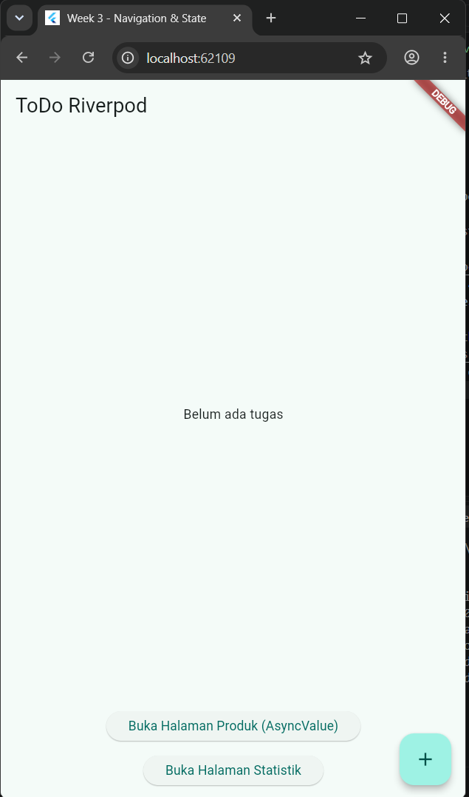
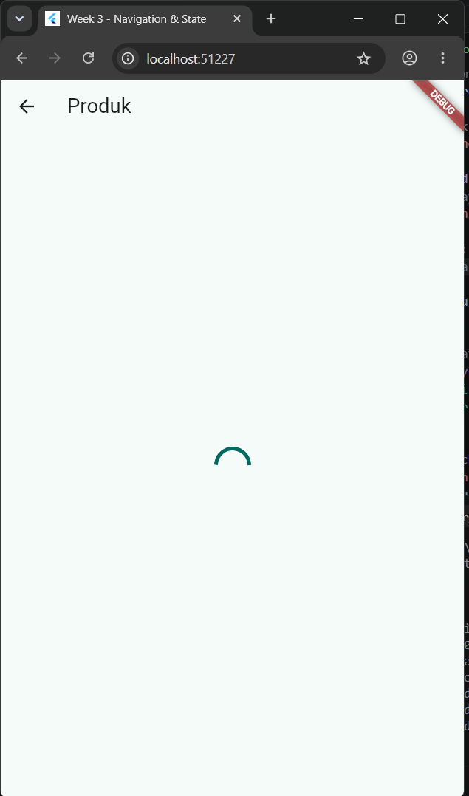
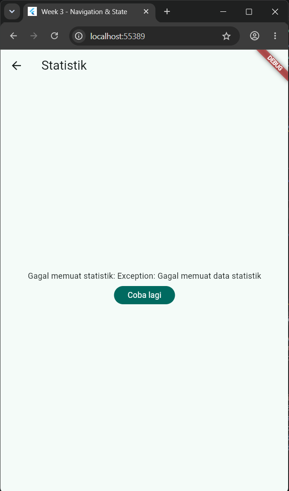
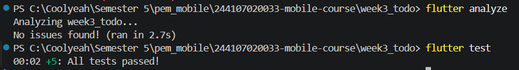

# Praktikum 03: Navigation & State Management

## Tujuan Pembelajaran

Proyek ini dibuat untuk memenuhi tugas praktikum minggu ke-3 yang berfokus pada:

- Menerapkan navigasi *multi-page* menggunakan **GoRouter**, termasuk penanganan *passing argument*.
- Mengelola *state* aplikasi menggunakan **Riverpod** (`Provider`, `ConsumerWidget`, `Notifier`).
- Menangani state asinkron (*loading*, *error*, *success*) pada UI menggunakan **AsyncValue**.
- Melakukan *refactoring* dan memverifikasi aplikasi ToDo menggunakan *widget test* sederhana.

## Teknologi yang Digunakan

| Komponen | Teknologi |
| --- | --- |
| Framework | Flutter SDK |
| State management | `flutter_riverpod` |
| Routing | `go_router` |
| Testing | `flutter_test` |

## Hasil yang Dicapai

- **Konsep navigasi dan GoRouter:** Memahami dasar-dasar navigasi, konsep route, dan perbedaan metode navigasi antara Navigator 1.0 bawaan Flutter dan package GoRouter.
- **Navigasi multi-page:** Menerapkan perpindahan antarhalaman menggunakan GoRouter secara deklaratif, termasuk praktik passing argument dan pemahaman deep link sederhana.
- **Konsep dasar state management:** Memahami alasan state management diperlukan dalam pengembangan aplikasi skala besar dan cara kerja Riverpod, meliputi penggunaan Provider, ConsumerWidget, dan class Notifier.
- **Penanganan state asinkron (AsyncValue):** Mengelola proses asinkron, seperti pemanggilan API atau simulasi delay jaringan, berdasarkan tiga kondisi utama: loading, error, dan success.
- **Integrasi dan pengujian:** Membangun aplikasi ToDo dengan mengintegrasikan navigasi GoRouter dan manajemen state Riverpod, lalu memverifikasi fungsionalitas UI melalui widget test sederhana.

## Dokumentasi Praktikum

| Tahap / Fitur | Penjelasan Implementasi | Screenshot UI |
| --- | --- | --- |
| **1. Navigasi GoRouter** | Mengganti `Navigator 1.0` dengan `GoRouter`, lalu menerapkan rute utama `/` untuk ToDo dan `/stats` untuk halaman statistik. |  |
| **2. State loading** | Menggunakan `AsyncValue.loading()` saat `StatsNotifier` melakukan *fetch* data dengan simulasi *delay* 2 detik. |  |
| **3. State error** | Menggunakan `AsyncValue.error()` untuk menangani kegagalan jaringan dengan simulasi kemungkinan gagal 30% dan tombol *retry*. |  |
| **4. State success** | Menggunakan `AsyncValue.data()` untuk menampilkan daftar statistik dengan `ListView`. |  |

## Hasil Verifikasi Kode AI

### 1. State immutable

**Pertanyaan:** Apakah state diubah secara immutable, tanpa `state.add()` atau mutasi list langsung?

**Jawaban:** Ya. State dibentuk secara immutable. Pada kelas `StatsNotifier`, data kembalian berupa `List<String>` baru dari dalam metode `build()`, tanpa mutasi list secara langsung seperti `state.add()`.

### 2. Penggunaan `ref.watch` dan `ref.read`

**Pertanyaan:** Apakah `ref.watch` hanya dipakai di dalam `build`, dan `ref.read` di callback?

**Jawaban:** Ya. Pemanggilan `ref.watch(statsProvider)` diletakkan di dalam metode `build()`. Pada callback `onPressed` tombol retry, kode menggunakan `ref.invalidate(statsProvider)` untuk memicu ulang provider asinkron.

### 3. Penanganan state `AsyncValue`

**Pertanyaan:** Apakah ketiga state `AsyncValue` benar-benar ditangani, bukan hanya success?

**Jawaban:** Ya. Ketiga kondisi ditangani menggunakan fungsi `.when()`:

- **Loading:** Menampilkan `CircularProgressIndicator`.
- **Error:** Menampilkan pesan "Gagal memuat statistik" beserta tombol "Coba lagi".
- **Data:** Menampilkan data menggunakan `ListView.builder`.

### 4. Deklarasi provider

**Pertanyaan:** Apakah provider dideklarasikan dengan tipe eksplisit dan tidak duplikat dengan provider lain?

**Jawaban:** Ya. Provider dideklarasikan secara eksplisit dengan tipe `AsyncNotifierProvider<StatsNotifier, List<String>>` dan tidak terdapat duplikasi penamaan provider.

### 5. Penggunaan API Riverpod

**Pertanyaan:** Apakah kode AI memakai API Riverpod versi lama?

**Jawaban:** Tidak. Kode menggunakan arsitektur Riverpod 2.0+ dengan kombinasi `AsyncNotifier`, `AsyncNotifierProvider`, dan pola `ConsumerWidget`. Tidak ditemukan pola lama seperti `StateProvider` atau `StateNotifierProvider`.

### 6. Hasil `flutter analyze` dan `flutter test`

**Pertanyaan:** Apakah hasil AI lolos tanpa warning?

**Jawaban:** Ya. `flutter analyze` menghasilkan keluaran "No issues found!" tanpa warning atau lint error. Pengujian widget juga berhasil karena semua widget esensial dimuat dengan benar.

## Refleksi

### 1. Kapan `setState` masih cukup, dan kapan state harus naik ke Riverpod?

`setState` masih relevan dan cukup untuk *state* UI lokal sementara, seperti animasi, memperluas *card*, atau *input text*. State perlu "naik" ke Riverpod ketika data menjadi *global*, dibutuhkan oleh beberapa *widget* atau halaman, atau perlu dipertahankan (*persist*) selama navigasi antar layar.

### 2. Apa perbedaan `context.go` dan `context.push`, dan kapan masing-masing tepat digunakan?

- `context.go` mengubah URL rute dan mereset tumpukan (*stack*) navigasi. Cara ini cocok untuk navigasi utama yang tidak memerlukan tombol "kembali", seperti berpindah antar tab pada *BottomNavigationBar*.
- `context.push` menumpuk (*push*) halaman baru di atas halaman saat ini. Cara ini cocok untuk membuka halaman *detail* atau *form* ketika pengguna diharapkan dapat kembali ke halaman sebelumnya menggunakan tombol *back*.

### 3. Bagaimana `AsyncValue` mencegah bug dibanding tiga boolean terpisah?

Penggunaan tiga *boolean*, misalnya `isLoading`, `hasError`, dan `isSuccess`, rawan menghasilkan *state* yang tidak valid secara bersamaan, seperti `isLoading = true` sekaligus `hasError = true`. `AsyncValue` menggunakan konsep *sealed class* yang memastikan aplikasi hanya berada dalam salah satu status pada satu waktu, sehingga UI tetap sinkron dengan status data.

### 4. Bagian mana dari hasil AI yang Anda perbaiki, dan mengapa?

Saya memodifikasi *class* `StatsNotifier` hasil generate AI dengan menambahkan injeksi dependensi melalui parameter opsional `delay` dan *callback* `shouldFail`. Perubahan ini membuat *notifier* lebih *testable* atau mudah diuji saat *unit testing*, karena simulasi *error* dan *delay* dapat dikontrol tanpa bergantung pada probabilitas acak dari `math.Random()`.

### 5. Mengapa menampilkan ulang data lama (*stale data*) dengan indikator refresh kadang lebih baik daripada mengosongkan layar?

Menghapus data saat *refresh* akan membuat layar kosong (*blank*) dan dapat mengganggu kenyamanan visual pengguna. Dengan mempertahankan *stale data* sambil menampilkan indikator *loading*, seperti pada *pull-to-refresh*, pengguna tetap mendapatkan konteks informasi sebelumnya sambil mengetahui bahwa data terbaru sedang diproses.