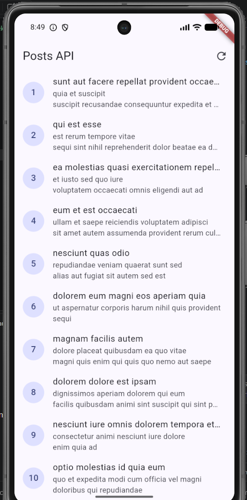
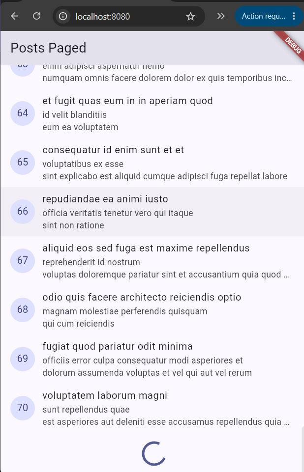
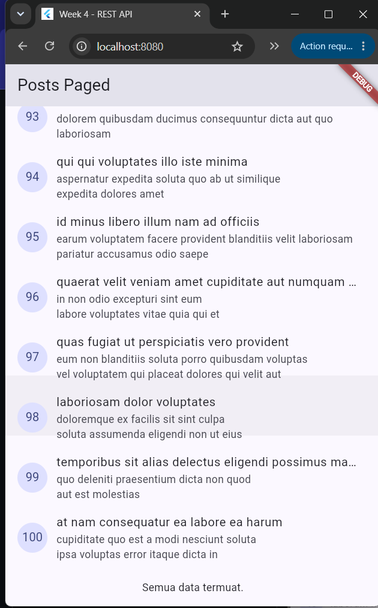
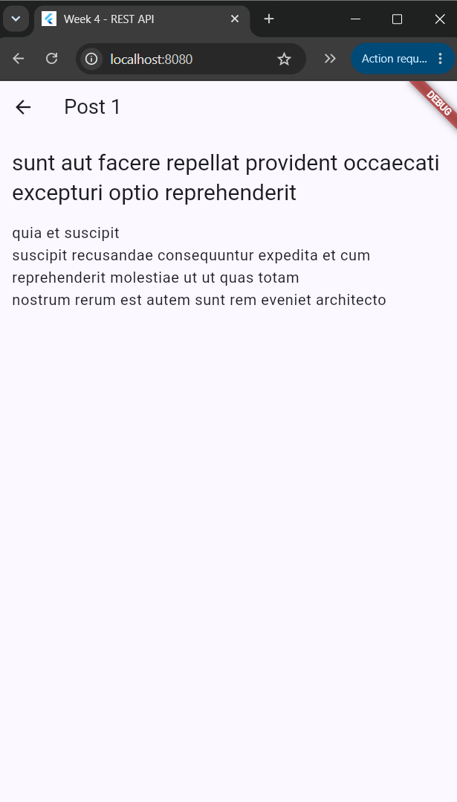
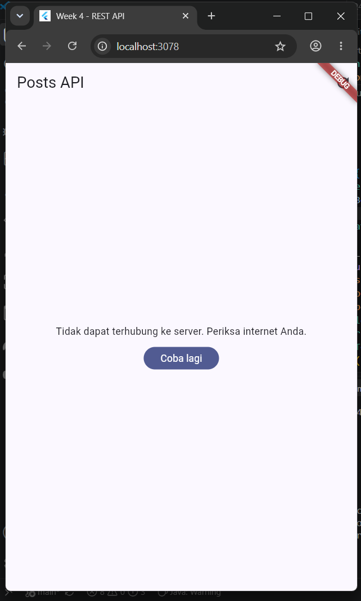
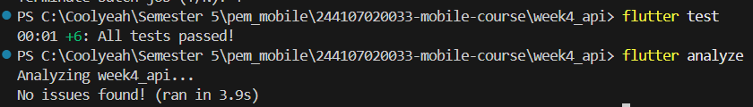

# Week 4: Networking & REST API

## Tujuan dan Fitur Utama
Aplikasi ini merupakan implementasi Praktikum 1 hingga Praktikum 3 untuk Networking & REST API di Flutter. Fitur utamanya meliputi:
- Konfigurasi HTTP Request tersentralisasi menggunakan Dio dengan interceptors dan base options.
- Pemisahan Data Layer menggunakan pola Repository agar UI tidak terikat langsung pada framework HTTP.
- Penggunaan JSON serialization dengan pemetaan yang aman terhadap tipe data null (`null-safety fromJson`).
- Riverpod state management (`AsyncNotifier` & `FutureProvider`) dengan penanganan otomatis untuk state Loading, Error, Empty, dan Success.
- UI menampilkan pesan error yang ramah pengguna (Network timeouts, HTTP 404/500, Connection error).
- Implementasi infinite scroll pagination.
- Detail routing menggunakan `go_router`.

## Stack Teknologi
- **Flutter & Dart** (UI & Logic)
- **Dio** (HTTP networking)
- **Flutter Riverpod** (State management & dependency injection)
- **GoRouter** (Routing navigation)

## Screenshots Page

| Deskripsi | Screenshot |
| --- | --- |
| **Halaman Utama (List Post)** <br> Menampilkan daftar data Post setelah berhasil diambil dari API. |  |
| **Loading Pagination** <br> Menampilkan indikator loading (CircularProgressIndicator) di bawah daftar saat mengambil data halaman berikutnya. |  |
| **Batas Akhir Scroll** <br> Menampilkan teks pemberitahuan ketika seluruh halaman data (100 item) telah termuat habis. |  |
| **Halaman Detail Post** <br> Menampilkan isi lengkap Post ketika salah satu item ditekan (dikelola via GoRouter). |  |
| **Halaman Error (Koneksi Gagal)** <br> Tampilan informatif yang ramah pengguna saat koneksi gagal atau Base URL salah, dilengkapi dengan tombol *Coba lagi*. |  |

## Hasil Testing dan Analyze

Kode aplikasi telah dipastikan terbebas dari issue dan seluruh unit test lulus dengan sukses.
- **Flutter Analyze**: `No issues found!`
- **Flutter Test**: Semua 5 pengujian (termasuk unit test dari AI Challenge, mapping error message, dan mock provider success/error) **passed**.



## Refleksi

1. **Mengapa UI dilarang memanggil Dio langsung? Apa yang rusak jika aturan ini dilanggar?**
   UI dilarang memanggil Dio langsung untuk menjaga prinsip *Separation of Concerns* (pemisahan tanggung jawab). Jika dilanggar, UI akan dibebani tugas melakukan parsing JSON, manajemen status exception, dan logic HTTP. Hal ini menyebabkan kode menjadi sangat berantakan (*spaghetti code*), tidak bisa diuji melalui Unit Test (karena UI tightly coupled dengan networking), dan sangat sulit di-maintain jika suatu saat library HTTP perlu diganti.

2. **Kapan pagination client-side cukup, dan kapan harus mengandalkan pagination server (`_page`/`_limit`)?**
   Pagination client-side cukup ketika ukuran dan jumlah total data cukup kecil (ratusan baris) dan tidak akan membebani memori, performa rendering, atau kuota internet. Sedangkan pagination server-side wajib dipakai ketika record berjumlah ribuan hingga jutaan agar request ringan dan aplikasi tidak mengalami `OutOfMemory` (OOM).

3. **Bagaimana exception repository berubah menjadi `AsyncError` tanpa try/catch di setiap widget? Kapan try/catch eksplisit tetap dibutuhkan?**
   Exception di repository akan dilempar ke layer Provider (misalnya dalam method `build` di `AsyncNotifier` atau dari `FutureProvider`). Riverpod mendengarkan `Future` tersebut, menangkap error-nya secara internal, dan otomatis mengubah status AsyncValue menjadi `AsyncError`. Exception ini kemudian divisualisasikan oleh UI melalui `.when(error: ...)`. Try/catch eksplisit tetap dibutuhkan dalam method mutator/fungsi manual di Notifier (seperti `refresh()` atau `loadNextPage()`), karena Riverpod tidak otomatis me-wrap block fungsi biasa menjadi state error.

4. **Bagian mana dari hasil AI yang Anda perbaiki, dan mengapa?**
   Saya harus mengganti implementasi `FamilyAsyncNotifier` menjadi `FutureProvider.family`. Hal ini dikarenakan pada Riverpod tanpa *code generation*, API family class untuk AsyncNotifier (terutama pada lint analyzer) sangat rawan error (`extends_non_class` & class boundary issues). Memakai `FutureProvider.family` memberikan fitur penanganan error yang setara (`AsyncError`) tanpa mengorbankan keamanan typesafety di versi non-codegen.

## AI Challenge

**Prompt yang Digunakan:**
```
Buatkan repository layer Flutter untuk endpoint GET /comments?postId={id}
dari JSONPlaceholder menggunakan Dio + flutter_riverpod.
Requirements:
- Model Comment dengan fromJson aman null (postId, id, name, email, body).
- CommentRepository dengan method fetchComments(postId) + timeout 10 detik.
- AsyncNotifierProvider dengan penanganan error otomatis (AsyncError)
  dan fungsi pesan error ramah pengguna untuk timeout, connection error, 404, dan 500.
- Satu unit test untuk fromJson dengan field yang hilang.
Jelaskan setiap bagian kode dalam komentar.
```

**Checklist Verifikasi:**
- **UI & Repository:** UI/Provider terbukti memanggil melalui repository secara terpusat, bukan memanggil Dio langsung.
- **Null Safety:** `fromJson` di-handle dengan fallback value `??` untuk mengamankan data yang kosong/null.
- **Mapping Error:** Semua error seperti timeout dan connection ditangani dengan fungsi utilitas `friendlyErrorMessage`.
- **Client Configuration:** Timeout spesifik 10 detik dan client options telah ditangani sesuai requirements.
- **Unit Testing:** Kasus JSON tanpa field spesifik lolos unit test (`comment_test.dart`) dengan baik.
