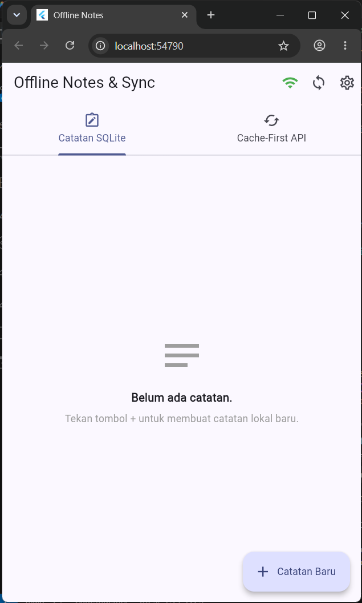
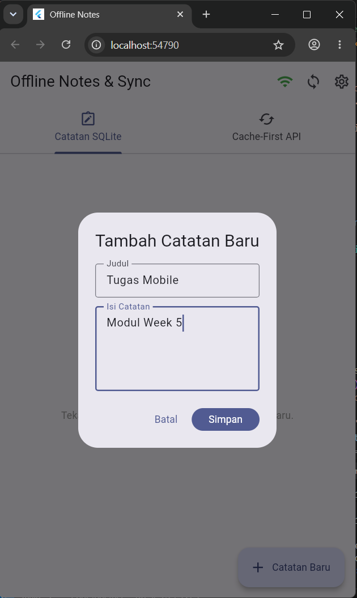
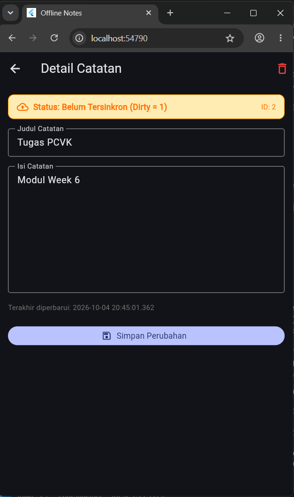
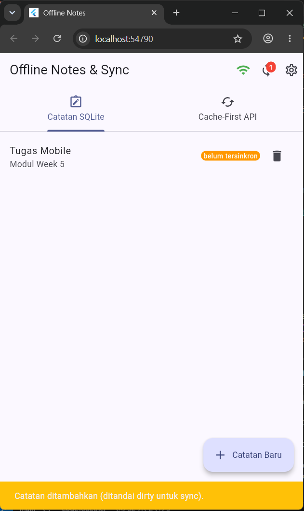
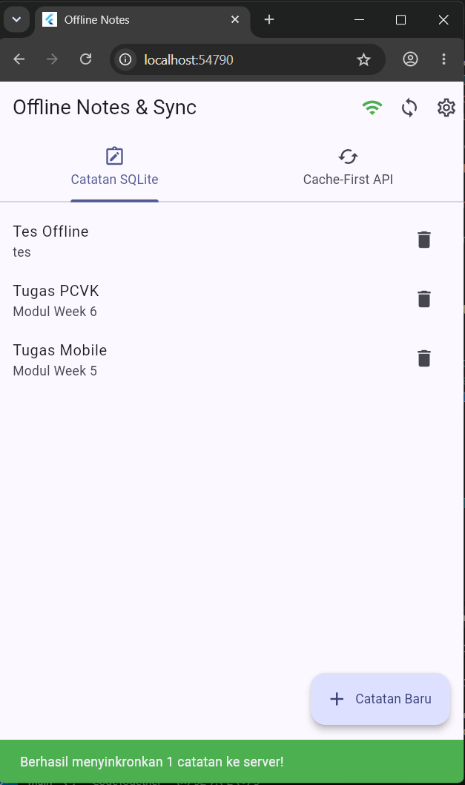
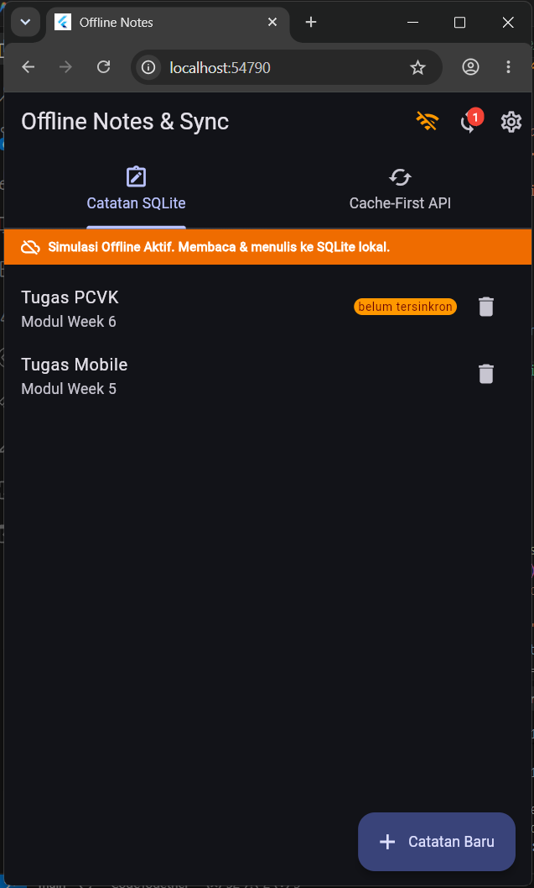
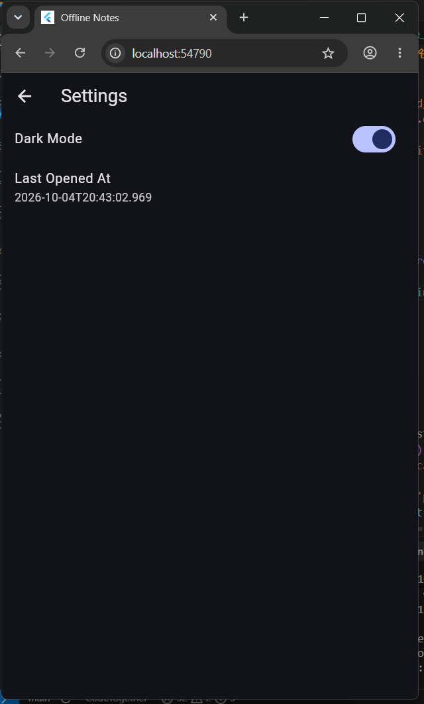

# 📓 Week 5 — Local Storage & Offline First

---

## 🎯 Tujuan Pembelajaran

Setelah menyelesaikan modul ini, mahasiswa mampu:

- Menjelaskan perbedaan penyimpanan **key-value**, **relasional**, dan **NoSQL** di perangkat mobile.
- Menyimpan preferensi sederhana (tema, waktu terakhir dibuka) menggunakan **SharedPreferences**.
- Menerapkan **CRUD catatan** dengan **SQLite** (`sqflite`) melalui repository lokal.
- Menerapkan pola **offline-first**: cache-first read, dirty flag, dan antrean sinkronisasi.
- Menampilkan state `loading`, `error`, `empty`, dan `success` untuk data lokal dengan **Riverpod**.
- Menguji repository lokal dengan **repository palsu** (tanpa database sungguhan).

---

## 🛠 Stack Teknologi

| Komponen | Teknologi |
|---|---|
| Framework | Flutter |
| State Management | Riverpod (`flutter_riverpod ^3.4.3`) |
| Routing | GoRouter (`go_router ^18.0.2`) |
| Key-Value Storage | `shared_preferences ^2.5.5` |
| Relational Storage | `sqflite ^2.4.4` + `sqflite_common_ffi_web ^1.2.0` |
| HTTP Client | `dio ^5.11.1` |
| Path Utility | `path ^1.9.1` |
| Testing (VM) | `sqflite_common_ffi ^2.4.3` (dev) |

---

## 📁 Struktur Proyek

```
week5_offline_notes/
├── lib/
│   ├── main.dart                        # Entry point + ProviderScope + routing
│   ├── data/
│   │   ├── local/
│   │   │   ├── db.dart                  # Pembuka database SQLite (openNotesDb)
│   │   │   └── note.dart                # Model Note + toMap/fromMap + dirty flag
│   │   ├── prefs.dart                   # PrefsRepository (SharedPreferences)
│   │   ├── repositories/
│   │   │   └── note_repository.dart     # CRUD catatan + providers Riverpod
│   │   └── sync.dart                    # Cache-first, syncNotes, forceOfflineProvider
│   ├── pages/
│   │   ├── notes_page.dart              # Halaman utama (Tab SQLite + Tab Cache-First)
│   │   ├── note_detail_page.dart        # Halaman detail & edit catatan (/note/:id)
│   │   └── settings_page.dart           # Pengaturan tema gelap/terang
│   └── widgets/
│       └── note_tile.dart               # Widget baris catatan + badge "Belum Tersinkron"
├── test/
│   ├── note_test.dart                   # 4 unit test (model + provider palsu)
│   └── widget_test.dart                 # Placeholder widget test
├── docs/
│   └── AI_CHALLENGE.md                  # Evaluasi perbandingan storage (AI Challenge)
├── screenshots/                         # Output screenshot hasil praktikum
└── README.md                            # Dokumentasi ini
```

---

## ▶ Cara Menjalankan

```bash
# 1. Masuk ke direktori proyek
cd week5_offline_notes

# 2. Unduh semua dependensi
flutter pub get

# 3. Jalankan aplikasi (pilih target: Chrome/Windows/Android)
flutter run

# 4. Jalankan static analysis
flutter analyze

# 5. Jalankan semua unit test
flutter test
```

> **Catatan Web:** Proyek ini dikonfigurasi untuk berjalan di Chrome menggunakan `sqflite_common_ffi_web`. Database SQLite berjalan di dalam browser via WebAssembly.

---

## 🔑 Praktikum 1 — SharedPreferences

### Konsep

`SharedPreferences` digunakan untuk menyimpan data **key-value primitif** yang sangat sederhana, seperti pengaturan tema dan waktu terakhir aplikasi dibuka. Aturan utama: **semua akses key-value terpusat di `PrefsRepository`**, tidak tersebar langsung di widget.

### Implementasi `lib/data/prefs.dart`

```dart
import 'package:shared_preferences/shared_preferences.dart';

class PrefsRepository {
  static const _darkModeKey = 'dark_mode';
  static const _lastOpenedKey = 'last_opened_at';

  Future<bool> getDarkMode() async {
    final prefs = await SharedPreferences.getInstance();
    return prefs.getBool(_darkModeKey) ?? false;
  }

  Future<void> setDarkMode(bool value) async {
    final prefs = await SharedPreferences.getInstance();
    await prefs.setBool(_darkModeKey, value);
  }

  Future<void> markOpenedNow() async {
    final prefs = await SharedPreferences.getInstance();
    await prefs.setString(_lastOpenedKey, DateTime.now().toIso8601String());
  }

  Future<String?> getLastOpened() async {
    final prefs = await SharedPreferences.getInstance();
    return prefs.getString(_lastOpenedKey);
  }
}
```

### Provider DarkModeNotifier (`lib/pages/settings_page.dart`)

```dart
final darkModeProvider =
    AsyncNotifierProvider<DarkModeNotifier, bool>(DarkModeNotifier.new);

class DarkModeNotifier extends AsyncNotifier<bool> {
  @override
  Future<bool> build() =>
      ref.watch(prefsRepositoryProvider).getDarkMode();

  Future<void> toggle() async {
    final next = !(state.value ?? false);
    state = const AsyncLoading();
    state = await AsyncValue.guard(() async {
      await ref.read(prefsRepositoryProvider).setDarkMode(next);
      return next;
    });
  }
}
```

### Hasil

Preferensi tema (gelap/terang) tersimpan secara persisten. Setiap kali aplikasi dibuka kembali, tema terakhir yang dipilih langsung diterapkan tanpa perlu konfigurasi ulang.

---

## 🗄 Praktikum 2 — SQLite & Repository Catatan

### Konsep

SQLite digunakan untuk menyimpan **data terstruktur relasional** (catatan). Setiap catatan memiliki flag `dirty` sebagai penanda bahwa catatan belum tersinkronkan ke server. Aturan arsitektur:
- **UI tidak boleh memanggil SQLite langsung** — UI hanya membaca provider.
- **`NoteRepository`** adalah satu-satunya pintu ke database.

### Model Note (`lib/data/local/note.dart`)

```dart
class Note {
  const Note({
    this.id,
    required this.title,
    this.body = '',
    required this.updatedAt,
    this.dirty = false,     // dirty flag: true = belum tersinkron
  });

  final int? id;
  final String title;
  final String body;
  final DateTime updatedAt;
  final bool dirty;

  Map<String, Object?> toMap() => {
    'id': id,
    'title': title,
    'body': body,
    'updated_at': updatedAt.toIso8601String(),
    'dirty': dirty ? 1 : 0,   // SQLite tidak punya tipe boolean asli
  };

  factory Note.fromMap(Map<String, Object?> map) { ... }
}
```

### Skema Database (`lib/data/local/db.dart`)

```sql
CREATE TABLE notes (
  id         INTEGER PRIMARY KEY AUTOINCREMENT,
  title      TEXT    NOT NULL,
  body       TEXT    NOT NULL DEFAULT '',
  updated_at TEXT    NOT NULL,
  dirty      INTEGER NOT NULL DEFAULT 0
);

CREATE TABLE cached_posts (
  id         INTEGER PRIMARY KEY,
  payload    TEXT    NOT NULL,
  cached_at  TEXT    NOT NULL
);
```

### Repository CRUD (`lib/data/repositories/note_repository.dart`)

| Method | Deskripsi |
|---|---|
| `fetchNotes()` | Ambil semua catatan, urut `updated_at DESC` |
| `getNoteById(id)` | Ambil satu catatan berdasarkan ID |
| `addNote(title, body)` | Tambah catatan baru, langsung `dirty = true` |
| `updateNote(note)` | Perbarui catatan, set `dirty = true` |
| `deleteNote(id)` | Hapus catatan dari database |
| `countDirty()` | Hitung catatan yang belum tersinkron |
| `markAllSynced()` | Set semua `dirty = 0` setelah sync sukses |

### Provider Riverpod

```dart
final noteRepositoryProvider = Provider<NoteRepository>((ref) {
  return NoteRepository();
});

final notesProvider = FutureProvider<List<Note>>((ref) async {
  return ref.watch(noteRepositoryProvider).fetchNotes();
});

final dirtyCountProvider = FutureProvider<int>((ref) async {
  return ref.watch(noteRepositoryProvider).countDirty();
});
```

---

## 🔄 Praktikum 3 — Cache-First & Antrean Sync

### Pola Cache-First Read

Pola ini memastikan UI **tidak pernah blank** meski sedang offline:

```
1. Baca cache lokal dari tabel cached_posts  <- tampilkan SEKETIKA
2. Jalankan refresh dari API di background   <- non-blocking
3. Simpan hasil refresh ke cached_posts      <- siap untuk sesi berikutnya
```

```dart
// lib/data/sync.dart
Future<List<Post>> loadPostsCacheFirst() async {
  final cached = await readCachedPosts();   // langsung kembalikan cache
  refreshPostsInBackground();               // refresh di background (tidak ditunggu)
  return cached;
}
```

### Simulasi Sinkronisasi (Dirty Flag)

```dart
Future<int> syncNotes(NoteRepository repo) async {
  final dirtyCount = await repo.countDirty();
  if (dirtyCount == 0) return 0;
  // Simulasi upload ke server (1 detik delay)
  await Future.delayed(const Duration(seconds: 1));
  await repo.markAllSynced();   // bersihkan dirty flag setelah "server menjawab 200"
  return dirtyCount;
}
```

### Toggle Simulasi Offline

```dart
class ForceOfflineNotifier extends Notifier<bool> {
  @override
  bool build() => false;         // default: online

  void toggle() => state = !state;
}

final forceOfflineProvider =
    NotifierProvider<ForceOfflineNotifier, bool>(ForceOfflineNotifier.new);
```

Ketika `forceOffline = true`: banner oranye muncul di atas layar, tombol sync menolak dengan peringatan, namun semua operasi SQLite tetap berjalan normal.

### Provider Cache-First Posts

```dart
class CachedPostsNotifier extends AsyncNotifier<List<Post>> {
  @override
  Future<List<Post>> build() => loadPostsCacheFirst();

  Future<void> manualRefresh() async {
    state = const AsyncLoading();
    state = await AsyncValue.guard(() async {
      await refreshPostsInBackground();
      return readCachedPosts();
    });
  }
}

final cachedPostsProvider =
    AsyncNotifierProvider<CachedPostsNotifier, List<Post>>(
      CachedPostsNotifier.new,
    );
```

---

## 📸 Hasil Output & Screenshot

### 1. Halaman Utama — Daftar Catatan (Tab SQLite)



Halaman utama aplikasi menampilkan daftar catatan yang tersimpan di SQLite lokal melalui tab **"Catatan SQLite"**. Catatan diurutkan berdasarkan `updated_at` terbaru. AppBar menampilkan: ikon Wi-Fi (hijau = online, oranye = simulasi offline), ikon Sync dengan badge merah jumlah catatan `dirty`, dan ikon Settings.

---

### 2. Menambah Catatan Baru



Dialog tambah catatan muncul saat tombol FAB **"Catatan Baru"** ditekan. Setelah disimpan, catatan langsung masuk ke SQLite lokal dengan status `dirty = true` dan badge merah pada tombol sync bertambah otomatis.

---

### 3. Edit / Detail Catatan



Halaman detail catatan (`/note/:id`) membaca data langsung dari `NoteRepository` lokal berdasarkan ID — bukan dari state list. Pengguna dapat mengedit judul dan isi; setelah disimpan, status `dirty` di-set kembali ke `true`.

---

### 4. Catatan Belum Tersinkron (Badge Dirty)



Badge merah pada tombol sync menunjukkan **jumlah catatan yang belum dikirim ke server** (`dirty = 1`). Widget `NoteTile` juga menampilkan label **"Belum Tersinkron"** pada setiap baris catatan yang `dirty = true`.

---

### 5. Setelah Sinkronisasi Berhasil



Setelah sync berhasil, `markAllSynced()` mengubah semua `dirty = 0`. Badge kembali ke **0**, label "Belum Tersinkron" menghilang, dan SnackBar hijau mengonfirmasi jumlah catatan yang disinkronkan.

---

### 6. Mode Offline (Simulasi)



Ketika toggle simulasi offline diaktifkan, ikon Wi-Fi berubah oranye dan banner **"Simulasi Offline Aktif"** muncul di atas. Semua operasi SQLite tetap berfungsi penuh, namun tombol sync menolak dengan pesan peringatan — membuktikan prinsip *offline-first*.

---

### 7. Pengaturan Tema Gelap



Halaman Settings menampilkan toggle **dark mode** yang menggunakan `SharedPreferences`. Nilai preferensi ini persisten — tetap aktif meski aplikasi ditutup dan dibuka kembali.

---

### 8. Hasil Flutter Analyze & Flutter Test


```
Analyzing week5_offline_notes...
No issues found! (ran in 3.2s)

00:01 +5: All tests passed!
```

`flutter analyze` tanpa issue dan semua 5 test lulus tanpa error.

---

## ♻ Refactoring Challenge

### 1. Ekstrak Widget `NoteTile` (`lib/widgets/note_tile.dart`)

Widget baris catatan yang menampilkan badge **"Belum Tersinkron"** ketika `note.dirty == true`. Mengekstrak widget ini membuat `notes_page.dart` lebih bersih dan `NoteTile` dapat digunakan kembali di tempat lain.

```dart
class NoteTile extends StatelessWidget {
  const NoteTile({required this.note, this.onTap, this.onDelete, super.key});
  // Menampilkan Chip "Belum Tersinkron" bila note.dirty == true
}
```

### 2. Pindahkan Logika ke `lib/data/sync.dart`

Semua logika yang bukan CRUD murni dipindahkan ke `sync.dart` agar `NoteRepository` tetap fokus pada CRUD catatan:
- `Post` model + `readCachedPosts()` — pembacaan cache dari SQLite
- `refreshPostsInBackground()` — fetch Dio ke JSONPlaceholder
- `loadPostsCacheFirst()` — pola cache-first
- `syncNotes()` — simulasi sinkronisasi dirty notes
- `ForceOfflineNotifier` + `forceOfflineProvider`
- `SyncService` + `syncServiceProvider`
- `CachedPostsNotifier` + `cachedPostsProvider`

### 3. Halaman Detail dengan GoRouter (`/note/:id`)

`lib/pages/note_detail_page.dart` diakses melalui `context.push('/note/${note.id}')`. Data dibaca dari `NoteRepository` berdasarkan ID, memastikan data selalu segar dari sumber lokal — bukan dari state yang berpotensi stale.

---

## 🧪 Testing

### Struktur Test

```
test/
├── note_test.dart    # 4 unit test (model + provider)
└── widget_test.dart  # Placeholder
```

### 4 Test Cases di `note_test.dart`

| # | Nama Test | Deskripsi | Hasil |
|---|---|---|---|
| 1 | `fromMap aman terhadap field yang hilang` | `Note.fromMap({'title': 'Belanja'})` — field opsional (`body`, `dirty`) menggunakan nilai default tanpa crash | ✅ PASS |
| 2 | `flag dirty bertahan pada serialisasi` | `toMap()` → `fromMap()` mempertahankan `dirty = true` secara roundtrip | ✅ PASS |
| 3 | `provider sukses dengan repository palsu` | `FakeNoteRepository` berisi 1 item — `notesProvider.future` mengembalikan 1 catatan | ✅ PASS |
| 4 | `provider error dengan repository palsu` | `FakeNoteRepository(throwError: true)` — `notesProvider.future` melempar `Exception` | ✅ PASS |

### Teknik: `FakeNoteRepository`

```dart
class FakeNoteRepository extends NoteRepository {
  FakeNoteRepository({this.items = const [], this.throwError = false})
      : super(openDb: () => throw UnimplementedError()); // DB tidak pernah dipanggil

  @override
  Future<List<Note>> fetchNotes() async {
    if (throwError) return Future.error(Exception('db locked (simulasi)'));
    return items;
  }
}
```

Database sungguhan **tidak pernah tersentuh** selama test. Provider di-override menggunakan `ProviderContainer.overrides`.

> **Catatan:** Ditambahkan `sqflite_common_ffi` ke `dev_dependencies` dan `sqfliteFfiInit()` di `setUpAll` agar Dart VM test runner dapat mengkompilasi rantai import melalui `db.dart` (yang menggunakan `sqflite_common_ffi_web`, paket khusus JS/web).

---

## 🤖 AI Challenge

### Prompt yang Digunakan

```
Aplikasi Flutter Offline Notes: CRUD catatan + preferensi tema.
Bandingkan SharedPreferences, Hive, sqflite (SQLite), dan Drift
untuk dua kebutuhan ini. Requirements:
- Kriteria: kompleksitas query, kebutuhan relasi, reaktivitas (stream),
  type-safety, ukuran boilerplate, dan kemudahan testing.
- Beri rekomendasi final: mana untuk preferensi, mana untuk catatan,
  beserta alasannya dalam 1 tabel.
- Tunjukkan skema tabel/kotak untuk 1000+ catatan.
Jelaskan trade-off setiap pilihan.
```

### Tabel Perbandingan Storage

| Kriteria | SharedPreferences | Hive | sqflite (SQLite) | Drift |
|---|---|---|---|---|
| **Kompleksitas Query** | Sangat Rendah (key-value saja) | Rendah–Menengah (filter terbatas) | Tinggi (SQL murni) | Tinggi (SQL type-safe dalam Dart) |
| **Kebutuhan Relasi** | Tidak ada | Sangat terbatas (referensi manual) | Tinggi (JOIN, Foreign Key) | Tinggi (deklaratif, relasi lanjut) |
| **Reaktivitas (Stream)** | Tidak ada | Dasar (`watch`) | Tidak ada (butuh paket tambahan) | Sangat kuat (`watchQuery` → Stream) |
| **Type-Safety** | Menengah (tipe dasar) | Menengah (butuh TypeAdapter) | Rendah (Map dinamis, rawan typo) | Sangat Tinggi (kode digenerate) |
| **Ukuran Boilerplate** | Sangat Rendah | Sedang (generator tipe kustom) | Sedang–Tinggi (create table manual) | Sangat Tinggi (build_runner, migrasi) |
| **Kemudahan Testing** | Mudah (`setMockInitialValues`) | Sedang (init direktori palsu) | Menengah (in-memory / fake repo) | Sedang (`NativeDatabase.memory()`) |

### Rekomendasi Final

| Kebutuhan | Pilihan | Alasan |
|---|---|---|
| **Preferensi Tema** | **SharedPreferences** | Data bersifat key-value primitif (`bool` dark mode). Tidak memerlukan query maupun relasi. Setup sangat ringan. |
| **Penyimpanan Catatan** | **sqflite (SQLite)** | Ribuan catatan butuh filter SQL yang efisien. Dirty flag diperbarui hanya 1 kolom. Boilerplate lebih kecil dari Drift (tidak perlu `build_runner`). |

### Skema untuk 1000+ Catatan

```sql
CREATE TABLE notes (
  id         INTEGER PRIMARY KEY AUTOINCREMENT,
  title      TEXT    NOT NULL,
  body       TEXT    NOT NULL DEFAULT '',
  updated_at TEXT    NOT NULL,
  dirty      INTEGER NOT NULL DEFAULT 0
);

-- Index untuk performa sorting dan filter sync
CREATE INDEX idx_notes_updated_at ON notes(updated_at DESC);
CREATE INDEX idx_notes_dirty ON notes(dirty);
```

### Checklist Verifikasi AI

| Pertanyaan | Jawaban |
|---|---|
| Apakah AI menempatkan daftar catatan di SharedPreferences? | **TIDAK** — AI merekomendasikan SQLite dengan benar. Menyimpan `List<Note>` sebagai JSON string sangat rapuh dan lambat pada 1000+ item. |
| Apakah skema AI mendukung antrean sync (dirty flag)? | **YA** — Skema menyertakan kolom `dirty INTEGER` dan `updated_at`, fondasi dirty-flag untuk antrean sync. |
| Apakah klaim "real-time" AI didukung stream? | **SEBAGIAN** — Untuk `sqflite`, tidak ada stream bawaan. Reaktivitas dicapai melalui `ref.invalidate()` Riverpod. |
| Apakah estimasi boilerplate masuk akal? | **YA** — Setelah `flutter pub add sqflite path`, setup minimal tanpa `build_runner`. |
| Keputusan final | **Mengikuti rekomendasi AI** — kombinasi SharedPreferences + sqflite memberikan keseimbangan produktivitas dan efisiensi untuk proyek ini. |

📄 Detail lengkap: [`docs/AI_CHALLENGE.md`](docs/AI_CHALLENGE.md)

---

## 💭 Refleksi

### 1. Mengapa daftar catatan tidak boleh disimpan di SharedPreferences?

`SharedPreferences` dirancang untuk nilai **primitif tunggal**. Menyimpan `List<Note>` berarti setiap kali **satu catatan berubah**, kita harus: (1) load seluruh JSON ke memori, (2) parse menjadi List, (3) modifikasi satu item, (4) encode kembali seluruh List, (5) tulis kembali seluruh string. Pada 1000+ catatan, operasi ini sangat lambat, boros memori, dan rawan **race condition**. SQLite hanya menyentuh baris yang relevan per operasi CRUD.

### 2. Kapan cache-first cukup, dan kapan strategi lain lebih baik?

**Cache-first cukup** untuk data yang tidak berubah sangat sering (catatan pribadi, artikel, katalog) dan ketika toleransi data *stale* dapat diterima. **Network-first** lebih baik untuk data sangat real-time (harga saham, saldo rekening). **Stale-while-revalidate** cocok untuk konten yang berganti periodik (berita, feed). **Write-through** diperlukan untuk data kritis yang harus segera konsisten di server (transaksi keuangan).

### 3. Bagaimana dirty flag berubah menjadi antrean sync tanpa memblokir UI?

(1) Operasi tulis langsung ke SQLite lokal dengan `dirty = 1` — instan, tanpa internet. (2) UI diperbarui via `ref.invalidate()` — tampilan langsung refresh. (3) `syncNotes()` dijalankan secara **async** tanpa memblokir UI thread. (4) Setelah "server menjawab 200", `markAllSynced()` membersihkan dirty flag.

**Kapan tabel outbox terpisah diperlukan?** Ketika operasi perlu di-sync adalah **operasi spesifik** (create/update/delete dengan payload berbeda), bukan sekadar "catatan dirty". Outbox menyimpan urutan operasi agar konflik dapat diselesaikan. Contoh: jika pengguna mengedit lalu menghapus catatan yang sama saat offline, dirty flag saja tidak cukup.

### 4. Bagian rekomendasi AI yang ditolak

AI menyarankan **Drift** karena reaktivitas stream-nya. Ditolak karena: (1) proyek ini tidak membutuhkan stream reaktif per-baris, (2) Drift membutuhkan `build_runner` yang signifikan, (3) reaktivitas sudah terpenuhi oleh `ref.invalidate()` Riverpod, dan (4) sqflite memberikan kontrol SQL penuh dengan boilerplate jauh lebih kecil untuk skala proyek ini.

---

